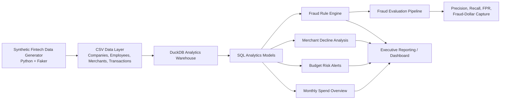

# Spend Intelligence & Fraud Monitoring Analytics Platform

An end-to-end financial operations and fraud analytics project that models company spending, employee budgets, transaction approvals, merchant payment health, and interpretable fraud detection rules.

Built with **Python, SQL, DuckDB, Pandas, Faker, and Streamlit-ready outputs**.

---

## Project Overview

Modern spend-management and fintech platforms need reliable analytics to help finance, risk, and operations teams monitor:

- Company spending and monthly transaction activity
- Employee budget overruns
- Suspicious or anomalous transactions
- Merchant-level payment declines
- Approval-rate deterioration
- Fraud-rule performance and operational false positives

This project generates a synthetic fintech transaction dataset, loads it into a local DuckDB warehouse, and produces SQL-driven reporting tables for financial operations and fraud monitoring. It also includes a labeled fraud benchmark to evaluate rule-based fraud detection using precision, recall, false-positive rate, and fraud-dollar capture.

---

## Architecture



---

## Repository Structure

```text
Spend-Intelligence-Fraud-Monitoring-Analytics-Platform/
├── data/
│   └── generated/
│       ├── companies.csv
│       ├── employees.csv
│       ├── merchants.csv
│       ├── transactions.csv
│       ├── monthly_spend_overview.csv
│       ├── budget_risk_alerts.csv
│       ├── fraud_alerts.csv
│       ├── merchant_decline_analysis.csv
│       ├── fraud_rule_evaluation_summary.csv
│       ├── fraud_rule_evaluation_by_type.csv
│       ├── fraud_rule_scored_transactions.csv
│       ├── velocity_threshold_experiment.csv
│       └── velocity_burst_evaluation.csv
├── docs/
│   └── fraud_rule_evaluation.md
├── python/
│   ├── generate_data.py
│   ├── load_duckdb.py
│   ├── run_analytics.py
│   ├── evaluate_fraud_rules.py
│   ├── evaluate_velocity_thresholds.py
│   └── evaluate_velocity_burst_detection.py
├── sql/
│   ├── 01_spend_overview.sql
│   ├── 02_budget_risk.sql
│   ├── 03_fraud_rules.sql
│   ├── 03_fraud_rules_transaction_level_backup.sql
│   └── 04_merchant_declines.sql
├── README.md
├── requirements.txt
└── .gitignore
```

---

## Dataset

| Table | Description |
|---|---|
| `companies` | Company identifiers, names, industries, and creation dates |
| `employees` | Employee, department, company, and monthly budget information |
| `merchants` | Merchant names, spending categories, and countries |
| `transactions` | Transaction amount, timestamp, approval status, decline reason, international indicator, and synthetic fraud labels |

Current generated dataset:

- 100 companies
- 2,000 employees
- 300 merchants
- 50,000 transactions
- 960 labeled synthetic fraud transactions

| Fraud Type | Transactions |
|---|---:|
| Large amount fraud | 500 |
| International purchase fraud | 300 |
| Velocity attack fraud | 160 |
| Non-fraud transactions | 49,040 |

---

## Analytics Modules

### 1. Monthly Spend Overview

Analyzes transaction count, total spend, average transaction amount, and payment approval rate.

| Month | Transactions | Total Spend | Avg. Transaction | Approval Rate |
|---|---:|---:|---:|---:|
| May 2026 | 4,404 | $606,925.31 | $137.81 | 92.05% |
| June 2026 | 4,101 | $563,589.16 | $137.43 | 92.44% |

### 2. Budget Risk Alerts

Budget-health rules:

- `within_budget`: below 80% of monthly budget
- `at_risk`: 80% to 99.99% of monthly budget
- `over_budget`: at least 100% of monthly budget

Example finding:

> Adrian Patterson spent $22,233.59 against a $6,846 monthly budget, reaching 324.77% of allocated budget.

Current output: **626 employee-month budget-risk alerts** after regenerating the fraud-labeled synthetic dataset.

### 3. Merchant Decline Analysis

Measures transaction volume, approval and decline counts, approval rate, decline rate, common decline reasons, and merchant payment health.

| Decline Rate | Classification |
|---|---|
| Below 8% | Healthy |
| 8% to under 12% | Monitor |
| 12% or more | High Decline Risk |

Current results:

- 166 healthy merchants
- 123 merchants to monitor
- 11 merchants with high decline risk

---

## Fraud Monitoring Rules

The final fraud-monitoring pipeline uses four interpretable SQL rule families.

1. **Large transaction rule:** flags approved transactions with amounts of at least `$5,000`.
2. **Unusual employee spending rule:** flags transactions greater than employee historical mean plus 3 standard deviations.
3. **International risk rule:** flags international approved transactions of at least `$1,000`.
4. **Burst-level velocity rule:** groups employee transactions into bursts separated by no more than 10 minutes and flags every transaction in a burst containing at least 3 transactions.

The burst-level approach detects the complete suspicious burst rather than only the final transaction that crosses a rolling-count threshold.

---

## Fraud Rule Evaluation

The fraud benchmark evaluates SQL fraud rules against hidden synthetic ground-truth labels.

### Final Overall Results

| Metric | Result |
|---|---:|
| Approved transactions scored | 46,092 |
| Ground-truth fraud transactions | 960 |
| Fraud alerts generated | 1,715 |
| True positives | 960 |
| False positives | 755 |
| False negatives | 0 |
| Precision | 55.98% |
| Recall | 100.00% |
| False-positive rate | 1.67% |
| Alert rate | 3.72% |
| Fraud dollars | $4,117,019.81 |
| Fraud dollars captured | $4,117,019.81 |
| Fraud-dollar capture rate | 100.00% |

### Detection Performance by Fraud Type

| Fraud Type | Fraud Transactions | Detected | Recall |
|---|---:|---:|---:|
| Large amount | 500 | 500 | 100.00% |
| International purchase | 300 | 300 | 100.00% |
| Velocity attack | 160 | 160 | 100.00% |

---

## Research Result: Velocity Detection Improvement

The original transaction-level velocity rule counted transactions in a rolling time window and detected only later transactions in a suspicious burst.

| Method | Velocity Recall | Precision | False-Positive Rate |
|---|---:|---:|---:|
| Transaction-level velocity counting | 46.88% | 100.00% | 0.00% |
| Threshold-tuned transaction rule | 50.00% | 100.00% | 0.00% |
| Burst-level grouping | 100.00% | 100.00% | 0.00% |

> Replacing transaction-level velocity counting with burst-level grouping improved velocity-attack recall from 46.88% to 100%, increased overall fraud recall from 91.15% to 100%, and increased fraud-dollar capture from 96.02% to 100%.

The final full fraud system retained a 1.67% false-positive rate.

---

## How to Run

```bash
python3 -m venv .venv
source .venv/bin/activate
pip install -r requirements.txt

python python/generate_data.py
python python/load_duckdb.py
python python/run_analytics.py
python python/evaluate_fraud_rules.py
python python/evaluate_velocity_thresholds.py
python python/evaluate_velocity_burst_detection.py
```

Generated outputs are saved in:

```text
data/generated/
```

---

## SQL and Data Concepts Demonstrated

- Common table expressions
- Multi-table joins
- Window functions
- `LAG()` for temporal transaction analysis
- Rolling transaction windows
- Burst segmentation
- Conditional logic with `CASE WHEN`
- Fraud-rule scoring
- Employee-level anomaly detection
- Merchant approval-rate analysis
- Precision and recall evaluation
- False-positive-rate measurement
- Fraud-dollar capture analysis
- Synthetic benchmark generation

---

## Limitations

The final benchmark should not be interpreted as expected production performance. The synthetic fraud generator creates patterns related to the detection rules, making this benchmark easier than a real adversarial fraud environment.

Future work should include held-out fraud mechanisms, adversarial patterns, time-based train/test splits, precision-recall tradeoff analysis, real anonymized transaction data, and human-review simulations.

---

## Future Improvements

- Add a Streamlit executive dashboard
- Add dbt transformations and data-quality tests
- Deploy PostgreSQL through Docker Compose
- Add fraud severity ranking and risk-weighted alert prioritization
- Add graph-based merchant-employee transaction features
- Compare SQL rules with Isolation Forest and supervised classifiers
- Build threshold optimization using expected fraud-loss reduction
- Add GitHub Actions for reproducible pipeline tests

---

## Resume Description

**Spend Intelligence & Fraud Monitoring Analytics Platform**  
*SQL, DuckDB, Python, Pandas, Faker*

- Built a financial-operations analytics warehouse modeling companies, employees, merchants, budgets, and 50,000 synthetic card transactions.
- Developed SQL reporting models for monthly spend, budget-risk alerts, merchant decline monitoring, and fraud detection.
- Designed and evaluated interpretable fraud rules using transaction size, employee spending history, international activity, and burst-level velocity signals.
- Built a labeled synthetic fraud benchmark with 960 fraud transactions and achieved 100% recall and 100% fraud-dollar capture at a 1.67% false-positive rate.
- Improved velocity-attack recall from 46.88% to 100% by replacing transaction-level rolling counts with burst-level transaction grouping.

---

## Disclaimer

All data in this repository is synthetic and generated for educational and portfolio purposes. No real financial, merchant, employee, or personal data is used.
