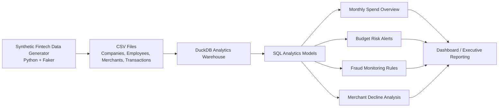

# Spend Intelligence & Fraud Monitoring Analytics Platform

An end-to-end financial operations analytics project that models company spending, employee budgets, transaction approvals, merchant payment health, and rule-based fraud alerts.

Built with **Python, SQL, DuckDB, Pandas, Faker, and Streamlit-ready outputs**.

---

## Project Overview

Modern spend-management platforms need reliable analytics to help finance teams monitor:

- Company spending and monthly transaction activity
- Employee budget overruns
- Suspicious or anomalous transactions
- Merchant-level payment declines
- Approval-rate deterioration and payment risk

This project creates a synthetic fintech transaction dataset, loads it into a local DuckDB warehouse, and produces SQL-driven reporting tables for financial operations and fraud monitoring.

---

## Architecture



---

## Repository Structure

```text
Spend-Intelligence-Fraud-Monitoring-Analytics-Platform/
├── data/
│   └── generated/
│       ├── companies.csv
│       ├── employees.csv
│       ├── merchants.csv
│       ├── transactions.csv
│       ├── monthly_spend_overview.csv
│       ├── budget_risk_alerts.csv
│       ├── fraud_alerts.csv
│       └── merchant_decline_analysis.csv
│
├── python/
│   ├── generate_data.py
│   ├── load_duckdb.py
│   └── run_analytics.py
│
├── sql/
│   ├── 01_spend_overview.sql
│   ├── 02_budget_risk.sql
│   ├── 03_fraud_rules.sql
│   └── 04_merchant_declines.sql
│
├── README.md
├── requirements.txt
└── .gitignore
```

---

## Dataset

The synthetic dataset contains:

| Table | Description |
|---|---|
| `companies` | Company identifiers, names, industries, and creation dates |
| `employees` | Employee, department, company, and monthly budget information |
| `merchants` | Merchant names, spending categories, and countries |
| `transactions` | Transaction amount, timestamp, approval status, decline reason, and international indicator |

Current generated dataset:

- 100 companies
- 2,000 employees
- 300 merchants
- 50,000 transactions

---

## Analytics Modules

### 1. Monthly Spend Overview

Analyzes monthly company-wide spending behavior:

- Transaction count
- Total spend
- Average transaction amount
- Payment approval rate

Example result:

| Month | Transactions | Total Spend | Avg. Transaction | Approval Rate |
|---|---:|---:|---:|---:|
| May 2026 | 4,404 | $606,925.31 | $137.81 | 92.05% |
| June 2026 | 4,101 | $563,589.16 | $137.43 | 92.44% |

---

### 2. Budget Risk Alerts

Identifies employees nearing or exceeding their monthly budget.

Budget-health rules:

- `within_budget`: below 80% of monthly budget
- `at_risk`: 80% to 99.99% of monthly budget
- `over_budget`: at least 100% of monthly budget

Example finding:

> Adrian Patterson spent $22,233.59 against a $6,846 monthly budget, reaching 324.77% of allocated budget.

The current analysis identified **173 employee-month budget-risk alerts**.

---

### 3. Fraud Monitoring Rules

Flags suspicious approved transactions through interpretable SQL rules:

- Large transaction amount: transaction amount at least $5,000
- Unusual employee spending: amount exceeds employee average by more than three standard deviations
- Transaction velocity: at least four transactions in ten minutes
- International-risk transaction: international transaction of at least $1,000

Each alert receives a fraud-risk score and classification:

| Risk Score | Risk Level |
|---:|---|
| 1 | Medium Risk |
| 2 or more | High Risk |

Current results:

- 1,300 total fraud alerts
- 117 high-risk alerts
- 1,183 medium-risk alerts

---

### 4. Merchant Decline Analysis

Evaluates merchant payment reliability using:

- Total transaction volume
- Approval and decline counts
- Approval rate
- Decline rate
- Most common decline reason
- Merchant payment-health classification

Merchant-health rules:

| Decline Rate | Classification |
|---:|---|
| Below 8% | Healthy |
| 8% to under 12% | Monitor |
| 12% or more | High Decline Risk |

Current results:

- 166 healthy merchants
- 123 merchants to monitor
- 11 high-decline-risk merchants

---

## How to Run

### 1. Create and activate the virtual environment

```bash
python3 -m venv .venv
source .venv/bin/activate
```

### 2. Install dependencies

```bash
pip install -r requirements.txt
```

### 3. Generate synthetic data

```bash
python python/generate_data.py
```

### 4. Create the DuckDB warehouse

```bash
python python/load_duckdb.py
```

### 5. Run all SQL analytics models

```bash
python python/run_analytics.py
```

Generated analysis outputs are saved in:

```text
data/generated/
```

---

## SQL Concepts Demonstrated

- Common table expressions
- Multi-table joins
- Window functions
- Rolling transaction windows
- Aggregations and grouped metrics
- Conditional logic with `CASE WHEN`
- Fraud-rule scoring
- Merchant approval-rate analysis
- Employee-level financial monitoring

---

## Future Improvements

- Add a Streamlit executive dashboard
- Add dbt models and data-quality tests
- Add PostgreSQL deployment through Docker Compose
- Add transaction-category forecasting
- Add customer churn or account-health scoring
- Compare rule-based fraud detection with anomaly-detection models
- Add automated GitHub Actions tests

---

## Resume Description

**Spend Intelligence & Fraud Monitoring Analytics Platform**  
*SQL, DuckDB, Python, Pandas, Faker*

- Built a financial-operations analytics warehouse modeling companies, employees, merchants, budgets, and 50,000 synthetic card transactions.
- Developed SQL reporting models for monthly spend, budget-risk alerts, fraud monitoring, and merchant-level payment-decline analysis.
- Implemented interpretable fraud rules using transaction size, employee historical behavior, international activity, and transaction-velocity signals.
- Identified 173 budget-risk employee-months, 1,300 fraud alerts, and 11 merchants with high payment-decline risk.

---

## Disclaimer

All data in this repository is synthetic and generated for educational and portfolio purposes. No real financial or personal data is used.
